### Spring Monitoring
- Monitoring adalah proses memeriksa bahwa aplikasi kita masih berjalan dengan baik
- Hal ini perlu kita lakukan, agar kita bisa mendeteksi sedini mungkin jika terjadi masalah di aplikasi yang kita buat
#
### Spring Actuator
- Spring Actuator gunakan untuk menambahkan kemampuan monitoring pada aplikasi yang kita buat.
- Dengan menambahkan fitur Spring Actuator ini, kita bisa menambahkan kemampuan monitoring, tanpa harus membuat secara manual
#
### Actuator Web Endpoint
- Saat kita menjalankan aplikasi web Spring Boot, secara otomatis Actuator bisa diakses melalui URL: `/actuator`
#
### Fitur Actuator
- Memonitor seluruh bean dalam project : `/actuator/beans`
- Ketika menambah fitur Spring Data JPA, secara otomatis Actuator akan menambahkan pengecekan ke database ketika kita memanggil endpoint health tersebut, Secara default fitur health itu aktif, dan bisa diakses menggunakan endpoint URL : `/actuator/health`
- Mengaktifkan endpoint actuator beans dan health pada application.properties
  
    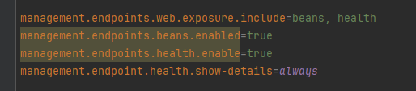

    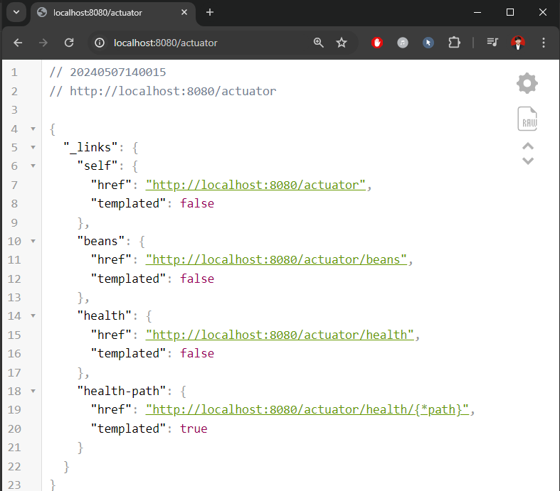

#
### Membuat Custom Health
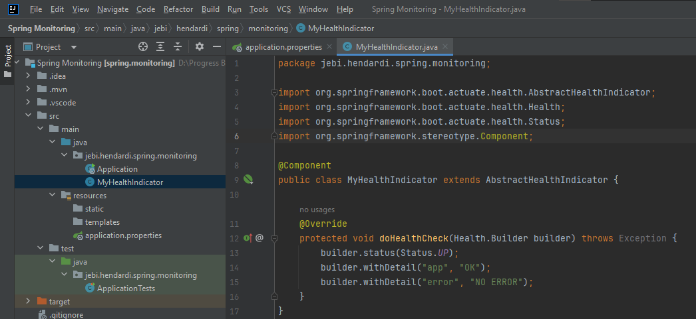

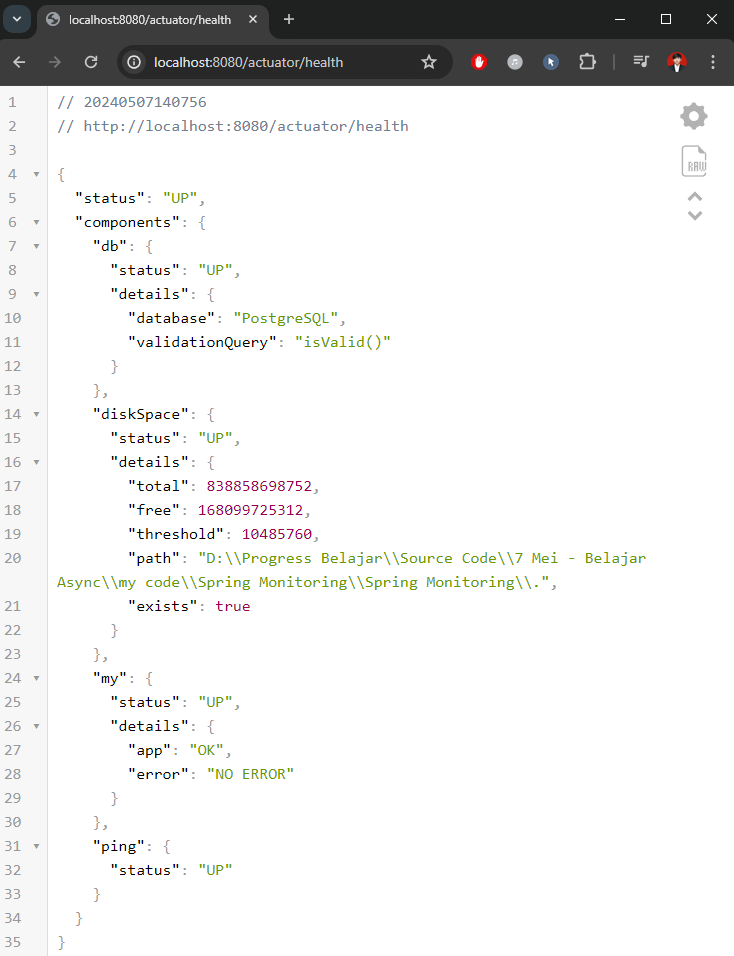

#
### Membuat Info
- Actuator memiliki fitur untuk menampilkan informasi 
- Kita bisa menambah informasi di properties dengan prefix info, yang nanti akan ditampilkan oleh Actuator
- Kita bisa mengakses informasi tersebut menggunakan endpoint URL :
`/actuator/info`

    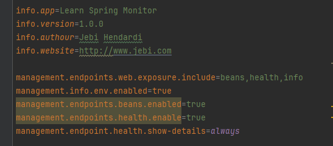

    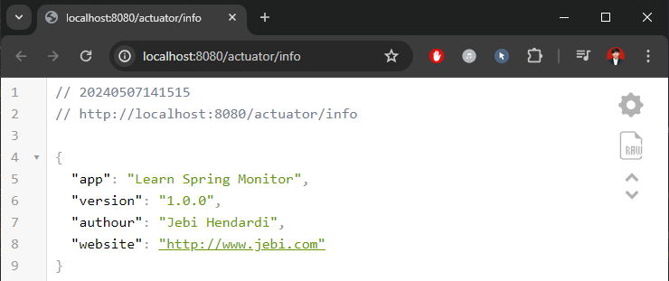

- Selain env, Info juga bisa mengambil informasi tentang os dan juga versi Java yang kita gunakan
  ```sh
    management.info.os.enabled=true
    management.info.java.enabled=true
  ```
  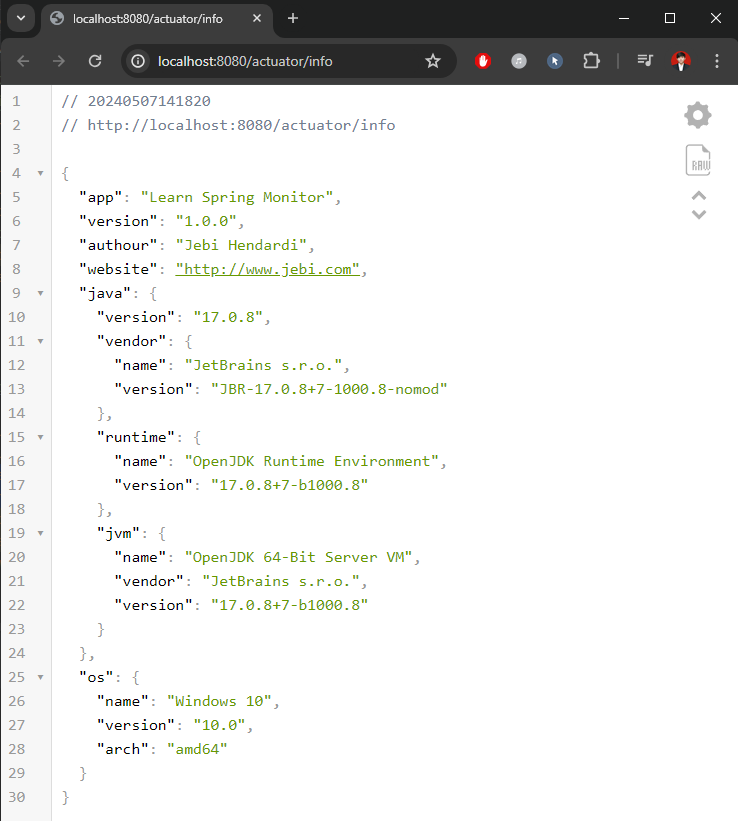

#
### Configuration Properties
- Semua konfigurasi di Application Properties kebanyakan berasal dari class Configuration Properties
- Kita bisa memonitor apa saja class Configuration Properties yang terdapat di aplikasi kita menggunakan Actuator
- Kita bisa mengakses informasi nya di endpoint URL : `/actuator/configprops`
  
  ```sh
  management.endpoints.web.exposure.include=beans,health,info,configprops
  ```
  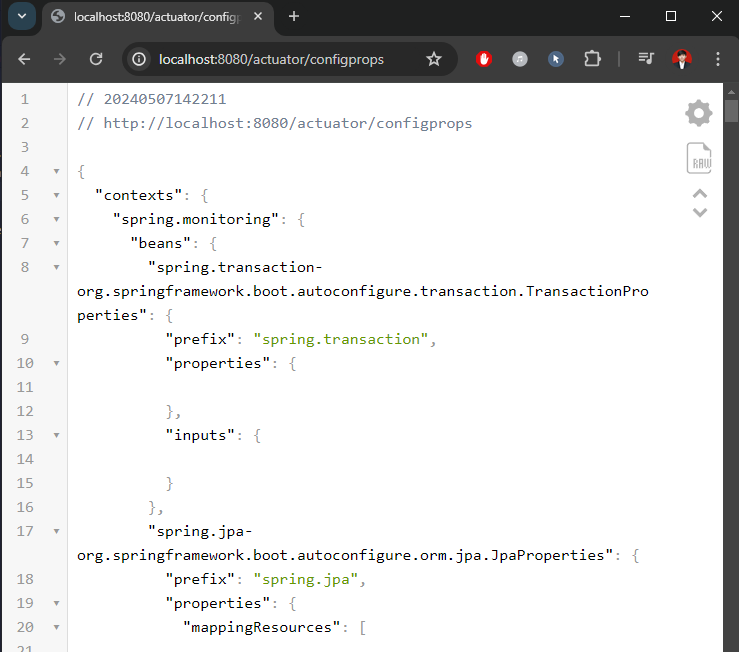

#
### Env
- Saat kita membuat aplikasi, kadang kita mengambil informasi dari environment variable, baik itu yang kita ubah sendiri, atau bawaan dari sistem operasi nya
- Kita bisa mendapatkan semua informasi menggunakan Actuator
- Kita bisa mengakses informasi env menggunakan endpoint URL : `/actuator/env`
    ```sh
    management.endpoints.web.exposure.include=env,beans,health,info,configprops
    management.info.env.enabled=true
    management.endpoint.env.show-values=always
    ```
    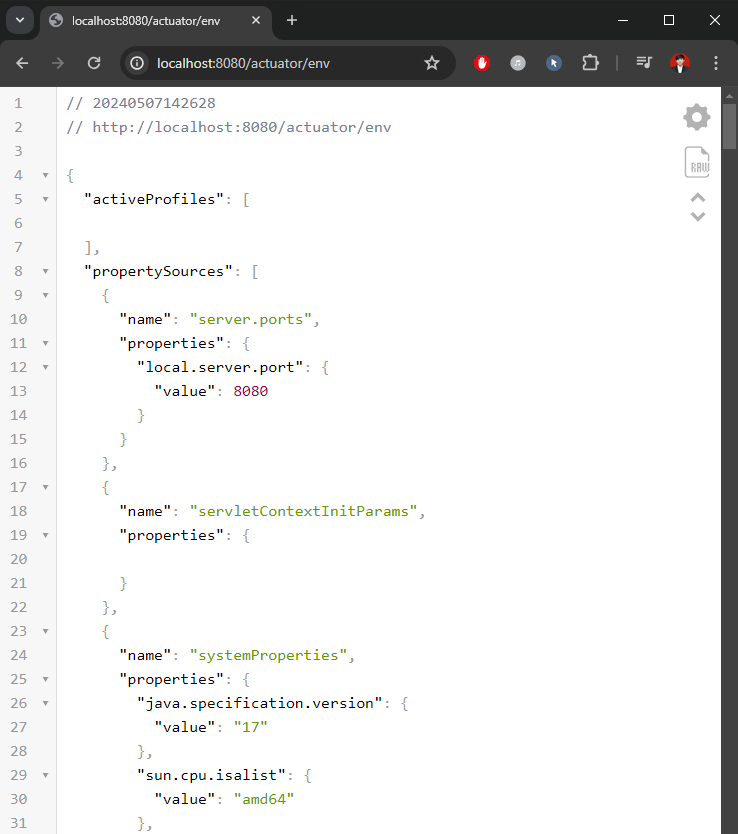

#
### Logger
- Secara default, aplikasi Spring Boot akan terintegrasi dengan Logging Library
- Kita bisa melihat informasi Logger yang terdapat di aplikasi kita, sekaligus dengan level logging nya menggunakan endpoint URL : `/actuator/loggers`
    ```sh
    management.endpoints.web.exposure.include=loggers,env,beans,health,info,configprops
    management.endpoint.loggers.enabled=true
    ```
    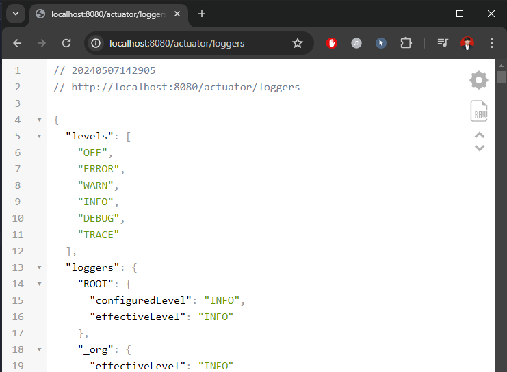

#
### Heap Dump
- Saat aplikasi Java kita jalankan, semua data di aplikasi akan disimpan di memory
- Kadang kita sering mengalami masalah yang bernama Memory Leak di aplikasi, oleh karena itu kadang kita butuh mendebut isi dari memory aplikasi kita
- Actuator memiliki fitur untuk melakukan dump (export isi memory) menggunakan endpoint URL : `/actuator/heapdump`
  
    ```sh
    management.endpoints.web.exposure.include=heapdump,loggers,env,beans,health,info,configprops
    management.endpoint.heapdump.enabled=true
    ```
    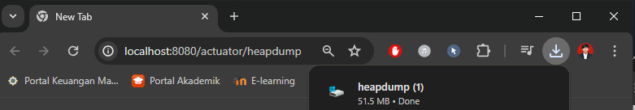

#
### Thread Dump
- Selain Heap Dump, Actuator juga memiliki fitur untuk menampilkan semua informasi Thread yang sedang berjalan di aplikasi
- Kita bisa melihat semua informasi Thread yang sedang berjalan menggunakan endpoint URL : `/actuator/threaddump`
  
    ```sh
    management.endpoints.web.exposure.include=threaddump,heapdump,loggers,env,beans,health,info,configprops
    management.endpoint.threaddump.enabled=true
    ```
    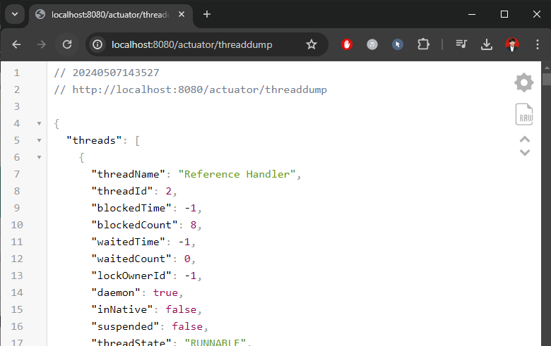

#
### Metrics
- Metric adalah informasi ukuran atau takaran dari proses yang terdapat di aplikasi
- Saat membuat aplikasi, kadang kita perlu mendapatkan informasi metric
Actuator, secara default sudah menyediakan metric yang bermanfaat yang bisa kita dapatkan menggunakan endpoint URL : `/actuator/metrics`

    ```sh
    management.endpoints.web.exposure.include=metrics,threaddump,heapdump,loggers,env,beans,health,info,configprops
    management.endpoint.metrics.enabled=true
    ```
    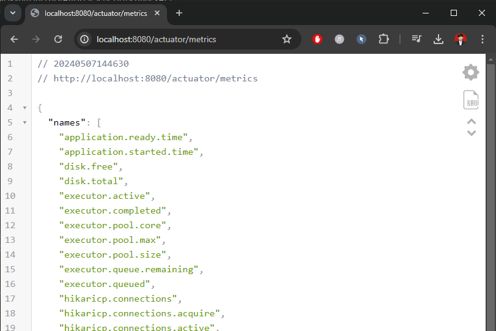
